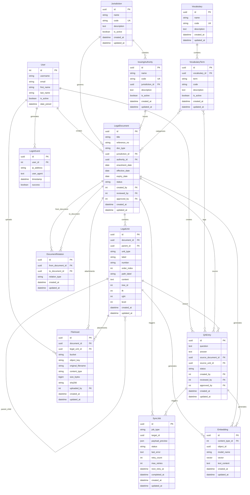

# Entity Relationship Diagram

## Key Relationships

### Masterdata Hierarchy
- **Jurisdiction** → **IssuingAuthority** → **LegalDocument**
- **Vocabulary** → **VocabularyTerm** → **Documents/QA** (M2M)

### Document Structure
- **LegalDocument** contains multiple **LegalUnit** (hierarchical via MPTT)
- Both can have **FileAsset** attachments
- **DocumentRelation** links documents (amends, repeals, etc.)

### Workflow
- Users create content in **Draft** status
- **Reviewers** can approve → triggers **SyncJob**
- **SyncJob** sends data to core service

### Search & Analytics
- **Embedding** stores vectors for semantic search
- Links to any content via Generic Foreign Key

## Indexes

### Performance Indexes
- `LegalDocument`: `(status, created_at)`, `(jurisdiction, authority)`
- `LegalUnit`: `(document, tree_id, lft)`, `(unit_type)`
- `FileAsset`: `(document)`, `(legal_unit)`, `(content_type)`
- `QAEntry`: `(status, created_at)`, `(source_document)`
- `SyncJob`: `(status, created_at)`, `(job_type)`
- `Embedding`: `(content_type, object_id)`, `(model_name)`

### Unique Constraints
- `Jurisdiction.code`
- `IssuingAuthority.code`
- `Vocabulary.code`
- `VocabularyTerm.(vocabulary, code)`
- `DocumentRelation.(from_document, to_document, relation_type)`
